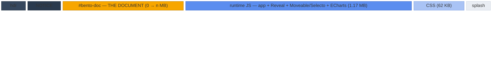
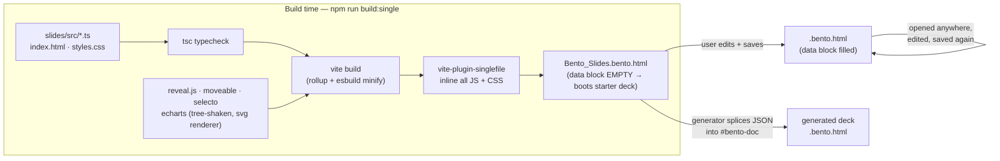
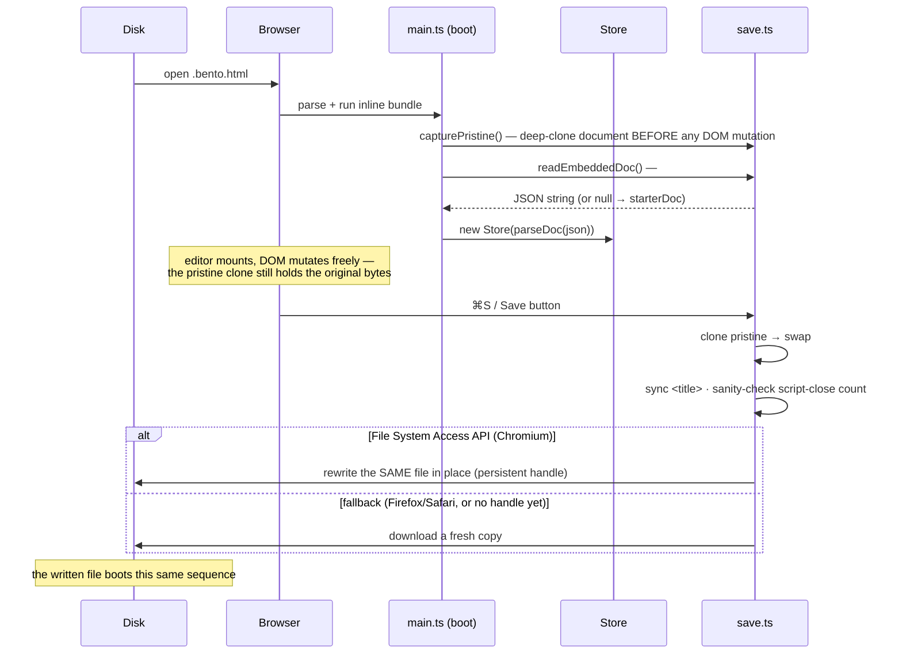
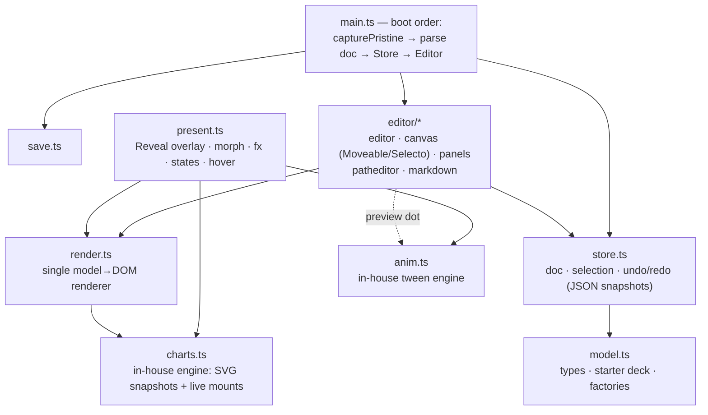

# Bento Slides — architecture

*Engineering reference, current as of July 2026. Covers how a `.bento.html`
file is constructed, what the on-disk format looks like, and how the runtime
is organized. User-facing documentation comes later, once the format
stabilizes for release.*

The core idea: **one HTML file is simultaneously the document, the viewer,
the presenter, and the editor.** There is no server, no install, and no
companion app — opening the file in a browser gives the full experience, and
the file saves *itself* back to disk with updated content (the TiddlyWiki
trick, modernized with the File System Access API).

---

> **v0.7.0 update**: the runtime now ships DEFLATE-compressed (shell ≈373KB,
> was 1.33MB) — byte order: chrome → NOTICE → tooling comment → **plaintext
> `#bento-doc`** → splash → compressed payloads + 1KB loader last. The
> document block stays plaintext forever (AI/tooling + old-updater splice
> contract; release.mjs gates every release on it). Charts are now in-house
> (`charts-lite`, MIT) — ECharts/zrender removed. Diagrams below describe the
> uncompressed layout; sizes predate compression.

> **v0.8.0 update**: live collaboration shipped — an in-house op-based CRDT
> (**bento-sync**, §8) with automatic same-machine sync (BroadcastChannel)
> and an optional end-to-end-encrypted blind relay (Cloudflare Durable
> Objects, `sync.bento.page`). The saved file stays a complete standalone
> document; `doc.collab {room, key}` is the only (additive) format change.

## 1. On-disk anatomy

A `.bento.html` file is ordinary, valid HTML. Its compartments, drawn
roughly to scale (widths √-compressed so the small parts stay visible —
exact numbers in the table below):



The amber block is the only part that changes between saves — everything
else is the fixed *shell*. Skeleton of the actual markup
(`dist-single/Bento_Slides.bento.html`):

```html
<!DOCTYPE html>
<html lang="en">
<head>
  <meta charset="UTF-8"> <meta name="viewport" …> <meta name="generator" content="bento-slides">
  <link rel="icon" href="data:image/svg+xml,…">
  <title>Deck title — Bento Slides</title>

  <!-- NOTICE — bundled open-source components …
       (license notices; part of the shell, so they travel with every copy) -->

  <!-- ═══ THE DOCUMENT ═══ (empty in a fresh shell → boots the starter deck) -->
  <script type="application/bento+json" id="bento-doc">
    {"format":"bento/slides","title":"…","size":{…},"slides":[…]}
  </script>

  <!-- ═══ THE RUNTIME ═══ viewer + presenter + editor, one inlined bundle -->
  <script type="module">/* ≈1.17 MB minified JS */</script>
  <style>/* ≈62 KB minified CSS — editor chrome, present overlay, print rules */</style>
  <style>/* splash CSS — paints before the bundle parses */</style>
</head>
<body>
  <div id="bento-splash">…</div>   <!-- pure-CSS boot splash -->
  <div id="app"></div>             <!-- the runtime mounts the editor here -->
</body>
</html>
```

Layout and sizes, in file order (byte offsets measured on the 1.24 MB shell;
they shift with the data block's size — the *order* is fixed):

| # | Part | Offset (shell) | ≈ size (raw) | What it is |
|---|---|---|---|---|
| 1 | Head chrome | 0 | 0.7 KB | doctype, metas, favicon, title |
| 2 | NOTICE comment | 653 | 2 KB | bundled-library license notices |
| 3 | **`#bento-doc` data block** | 2,825 | **0 → *n* MB** | **the document** — JSON, `<` escaped; assets are data URIs, so image-heavy decks dominate the file |
| 4 | Runtime JS | 2,854 | 1.17 MB | app (~120 KB) + Reveal.js + Moveable/Selecto family + ECharts/zrender (~610 KB) |
| 5 | Runtime CSS | 1,124,504 | 62 KB | editor + present + print styles |
| 6 | Splash CSS + body mounts | 1,186,508 | 2 KB | splash `<style>`/`<div>`, `#app` mount |

Whole shell: 1.24 MB raw, ≈392 KB gzipped, before any document content.

Two hard rules keep the file well-formed:

1. **The data block JSON escapes every `<` as `\u003c`**, so the string
   `</script>` can physically never appear inside it and terminate the block.
2. **The runtime source never contains a literal script-close tag** — the one
   place that needs it (`save.ts`) builds it by string concatenation, because
   that code ships *inside* a `<script>` element of the very file it writes.

## 2. How a file is constructed

Two producers make Bento files: the Vite build (makes the empty *shell*) and
the runtime's own save path (makes every subsequent copy). Generators (like
the testing deck transpiler) are a third, minor path: they take the shell and
splice a JSON document into its data block.



The saved file is again a complete construction kit — there is no difference
in kind between the shell and a user's document, only the data block content.

## 3. The self-save loop



Consequences of the pristine-clone design:

- Anything present in the shipped HTML (NOTICE comment, splash, favicon)
  survives every save unchanged — documents self-carry their license notices.
- The runtime version is **pinned inside each document**: opening an old file
  runs its old editor. Upgrading a document means re-splicing its data block
  into a newer shell (generators do exactly this).
- Editor state (selection, zoom, panel widths) never leaks into the file;
  only the model JSON changes between saves. UI prefs live in `localStorage`.

## 4. The document model (`format: "bento/slides"`)

The data block holds one JSON object. Sketch of the current shape — see
`src/model.ts` for the authoritative types:

```
BentoDoc
├─ format: "bento/slides"
├─ title
├─ size: { width: 1280, height: 720 }   ← canonical 16:9; per-doc, presets in the slide panel
├─ theme: { fontFamily, … }
├─ present?: { slideNumber?, controls?, progress? }
├─ assets?: { key → data URI }        ← images, fonts; referenced as "asset:key"
├─ fonts?: [{ family, assetKey }]     ← @font-face injected at boot
├─ layouts?: Slide[]                  ← templates; instantiation KEEPS element ids (lineage → morph continuity)
└─ slides: Slide[]                 ← linear order; states sit right after their parent
   ├─ id                           ← stable; morph matches elements ACROSS slides by element id
   ├─ background · transition      ← none | fade | slide | zoom | morph
   ├─ name? · notes
   ├─ stateOf?                     ← marks a hidden interactive state of another slide
   ├─ hover?                       ← { type:'focus-group', dim } | { type:'reveal', default }
   ├─ comments?                       ← review threads, anchored to element/point/slide (editor-only; window.bento.comments() for tooling)
   └─ elements: SlideElement[]     ← array order = paint order (z)
      ├─ common: id · x y w h · rotation · opacity
      │          fx? · link? · group? · groupId? · showOnHover? · role?
      ├─ text:  html (sanitized inline: b/i/u/s/code/br/span…) · placeholder? · fontSize · fontFamily
      │         fontWeight · color · align · valign · lineHeight · letterSpacing?
      ├─ shape: shape (rect|ellipse|triangle|arrow|line|path) · fill · fillGradient?
      │         stroke · strokeWidth · strokeStyle? (solid|dashed|dotted) · radius
      │         lineStart?/lineEnd? (none|arrow|dot|bar) · d?/pathBox? (path kind)
      ├─ image: src ("asset:key" or data URI) · fit · radius
      ├─ svg:   asset?/markup? · css? (scoped per element at render)
      ├─ chart: preset? · option · source? ← ECharts-SHAPED pure-JSON option
      │         (template-string formatters only — functions can't serialize);
      │         drawn by the in-house charts-lite engine; source={tableId}
      │         binds it live to a table element
      ├─ table: columns[{w}] · rows[{cells[{html,align?,color?,bg?,bold?}]}]
      │         · header · style{headerBg,zebra?,borderColor,cellPad…,radius…}
      │         ← a real HTML <table>, rendered by the shared renderer
      └─ media: kind (video|audio) · src (data URI | URL | "asset:key")
                · poster? fit? radius? · controls/autoplay/loop/muted
                ← autoplay fires in present mode only
```

Text also resolves dynamic-field tokens at render time — `{{page}}`,
`{{pages}}`, `{{title}}`, `{{date}}`, `{{time}}` (page/pages take a zero-pad
width, `{{page:2}}`) — so page numbering re-flows when slides move. The MODEL
stores the raw token; only the rendered output is resolved.

`fx` carries all presentation behavior:

| Field | Meaning |
|---|---|
| `enter: 'fade' \| 'fade-up' \| 'fade-down' \| 'slide-left/right/up/down'`, `order` | staggered entrance; equal `order` values enter together |
| `countUp` | numbers in the text animate 0 → final |
| `ambient: 'kenburns'`, `ken: {dir, scale, duration}` | photo drift loop, or one-shot zoom-in/out settle |
| `loop: {type:'dash-march', …}` | marching dashed strokes |
| `loop: {type:'motion-path', path, duration, delay}` | element travels an SVG path **relative to its rest position** (first point = 0,0) |

Interactivity is composed from three primitives, all plain data: element
`link` (click → jump to slide id), slide `stateOf` (hidden variants reached by
links, morphing on shared element ids), and `showOnHover` sets with slide
`hover` (in-slide hover reveals). Charts on either side of a morph with the
same element id additionally animate their *data* — the in-house chart engine
tweens the option's numeric leaves (a bar⇄pie type change stages a fade+sweep).

## 5. Runtime organization



One renderer, four surfaces — the same `render.ts` output is consumed
everywhere, which is what keeps WYSIWYG honest:

| Surface | Host | Charts | Notes |
|---|---|---|---|
| Editor canvas | `.ed-stage-scale` (CSS-scaled) | static SVG snapshot | Moveable control box mounts *inside* the scale wrapper (see CLAUDE.md gotcha #1) |
| Sidebar thumbnails | per-slide mini surface | snapshot | `svg` elements collapse to `` for cheapness |
| Present | Reveal.js sections | **live instance** (tooltips, dataZoom) | fx/morph/states run here only |
| PDF export | `#bento-print`, `@page` 1600×900 | snapshot | state slides excluded |

Animation is fully in-house (`anim.ts`, no GSAP): tween channels for
opacity/transform/colors/SVG attributes/motion paths, a per-element transform
registry that preserves model rotation, and kill/query APIs that the exit
restore and the 2.8 s wall-clock settle guarantee are built on. Morph
geometry is **model-driven** — both slides' frames are in the doc, so nothing
measures the DOM.

## 6. Format invariants

Things generators and future format revisions must not break:

1. `format: "bento/slides"` plus additive, optional fields — old files must
   open in newer shells (unknown fields are preserved by parse → serialize).
2. Element **ids are identity**: morphs match on them across slides, states
   sync from parents by id lineage, links point at slide ids. Generators must
   emit deterministic ids.
3. Data block JSON must stay `<`-escaped; chart options and text HTML must be
   pure data (the sanitizer whitelist and the no-functions rule exist so a
   document can never smuggle executable code through the model).
4. Asset references are `asset:` keys into `doc.assets`; nothing outside the
   file may be fetched at view time (single-file promise, and the CSP story
   for future hosting).
5. Motion paths are stored relative to the element's rest position; the first
   path point is that position by definition.
6. Every document carries a stable `docId` (uuid, minted at creation, minted
   on load for pre-docId files). It is identity for future sync/share/merge —
   never derive it from content, never regenerate it on save.

## 7. Self-update (signed releases)

A shipped file pins its runtime forever — it never needs the network. On
**user request only** (About dialog via the topbar logo, or
`window.bento.updates`), it can ask the release origin for a newer shell and
rebuild itself as *same document, newer app*:

```
check    GET manifest.json          { payload: "<json string>", sig: base64 }
verify   ECDSA P-256 / SHA-256 over the payload's exact bytes, against
         PUBLIC_KEY_JWK embedded in every shell (src/update.ts); then
         require payload.version > APP_VERSION (no downgrade replay)
fetch    GET payload.url → bytes; sha256(bytes) must equal payload.sha256
splice   DOMParser the new shell → save.serializeWith(shell, doc)
deliver  downloaded as a NEW file — the on-disk original is its own rollback
```

- `APP_VERSION` is baked at build from `slides/package.json` (vite `define`).
- The private key lives offline (`scripts/keygen.mjs` →
  `~/.bento/release-key.json`, never in repo or CI); `scripts/sign-release.mjs`
  hashes the built shell and writes the signed manifest. A compromised release
  host cannot forge an update without that key. Rotating the key orphans every
  shipped file — guard the key instead.
- Privacy: the check is a bare GET with no identifiers. It runs at launch by
  default (per-browser opt-out in the About dialog) or on demand.
- Update channel = signed **code**; future sync channel = inert **data**
  (invariant 3). Never mix the two.

## 8. Live collaboration (bento-sync)

The in-house CRDT designed in `collab-design.md`, shipped in v0.8.0.

```
slides/src/sync/crdt.ts     engine: per-property LWW registers ordered by
                            (lamport, actor); birth/tomb liveness (an ins is
                            a whole-node assignment that resurrects by
                            out-stamping the tomb); fractional-index order
                            keys; dead-window value stash; token RGA for
                            element.html (deterministic content-hash seeds;
                            a generation duels plain sets AS A UNIT);
                            per-actor contiguous seq + gap buffering;
                            state-based mergeSnapshot for file forks
slides/src/sync/session.ts  the store bridge: local commits → debounced
                            shadow diff → ops out; remote ops → surgical
                            apply → the same store events the editor
                            already listens to. Presence, catch-up, peers.
slides/src/sync/online.ts   E2EE relay transport: AES-GCM under the room
                            key from doc.collab; ?tok= is a hash of the
                            key (possession proof); reconnect + backoff;
                            encrypted client-produced snapshots cap replay
server/sync-worker/         Cloudflare Worker + one Durable Object per
                            docId: blind fan-out, encrypted op log, ~30-day
                            idle TTL. The only Bento server code.
scripts/test-sync.ts        property-based convergence rig (SEEDS/STEPS/
                            ACTORS env knobs) — random op interleavings
                            across simulated actors must converge to
                            byte-identical docs AND sync state
```

Same-machine tabs sync automatically (BroadcastChannel keyed by docId).
Online: credentials `doc.collab {room, key}` are minted at document
CREATION (random room id) and stay dormant until Share flips `on` — so any
copy sent BEFORE sharing started can still join, and "Rotate keys" revokes
every previously sent copy. Saves stamp the CRDT state (`doc.collab.sync`),
which is what lets a copy edited offline rejoin later and merge two-way:
its registers defend its edits, the room's replay fills in what it missed.
"Duplicate as new deck" re-mints identity for genuinely new documents.
The relay never sees plaintext, and every saved copy stays a complete,
standalone document (sync is a layer beside the file, never a replacement).

**Signed writes (v0.9.18).** `doc.collab` gained an ECDSA P-256 writer keypair
(`writerPub` in every copy, `writerPriv` in writer copies only) SEPARATE from
the symmetric read key. The room id COMMITS to the pubkey (`w`+b64url(sha256))
so the blind relay pins the writer key trustlessly and DROPS mutating frames
without a valid signature — a read-only copy is a writer copy with `writerPriv`
stripped, enforced at the edge, not by client courtesy. Legacy `r`-rooms stay
permissive. Full design + threat model: `collab-design.md`.
