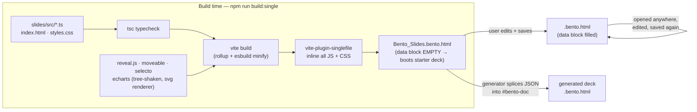
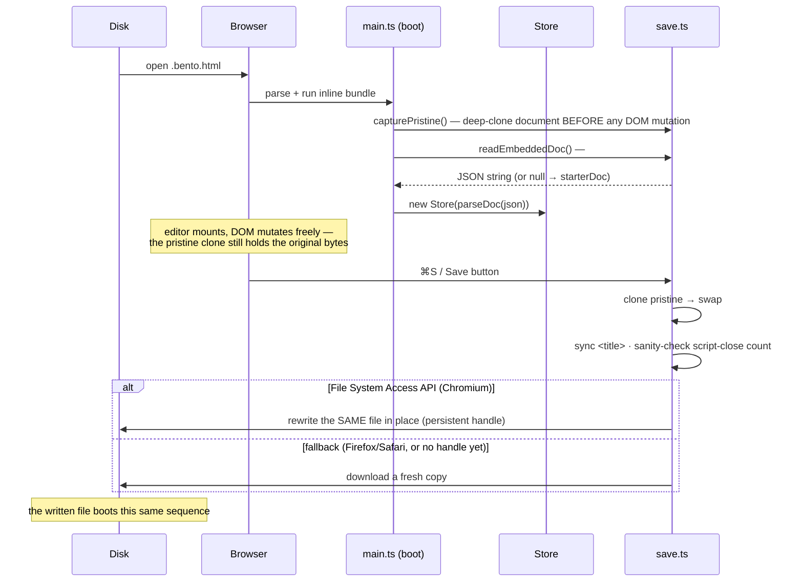
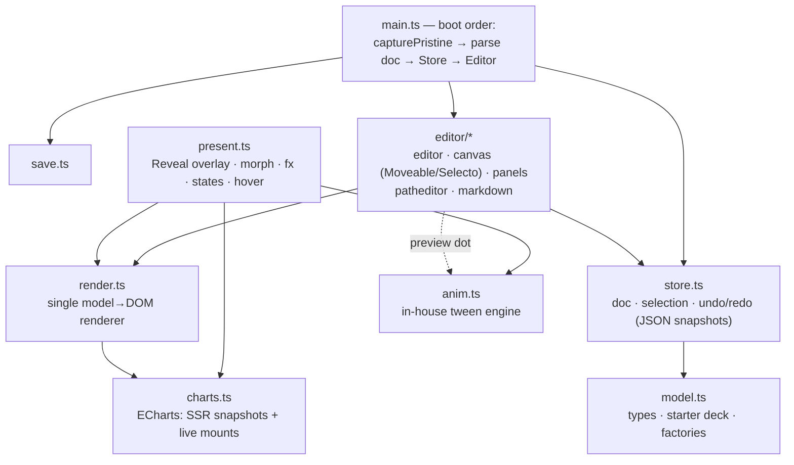

# Bento Slides — architecture

*Engineering reference, current as of July 2026. Covers how a `.bento.html`
file is constructed, what the on-disk format looks like, and how the runtime
is organized. User-facing documentation comes later, once the format
stabilizes for release.*

The core idea: **one HTML file is simultaneously the document, the viewer,
the presenter, and the editor.** There is no server, no install, and no
companion app — opening the file in a browser gives the full experience, and
the file saves *itself* back to disk with updated content (the TiddlyWiki
trick, modernized with the File System Access API).

---

## 1. On-disk anatomy

A `.bento.html` file is ordinary, valid HTML. Byte map of the current build
(offsets from the actual `dist-single/Bento_Slides.bento.html`, 1.24 MB shell):

```
offset     ┌──────────────────────────────────────────────────────────────┐
0          │ <!DOCTYPE html> <html lang="en"> <head>                      │
           │   <meta charset/viewport/generator>  <link rel="icon" …>    │
           │   <title>…</title>                                           │
653        │   <!-- NOTICE — bundled open-source components … -->         │  license notices travel
           │                                                              │  with every copy
2825       │   <script type="application/bento+json" id="bento-doc">     │
           │     {"format":"bento/slides","title":…,"slides":[…]}         │  ◀ THE DOCUMENT
           │   </script>                                                  │    (empty = starter deck)
2854*      │   <script type="module"> …1.17 MB minified JS… </script>     │  ◀ THE RUNTIME
           │     app code + Reveal.js + Moveable/Selecto + ECharts        │
1124504    │   <style> …62 KB minified CSS… </style>                      │  editor + present styles
1186508    │   <style> splash CSS </style>                                │  paints before JS parses
           │ </head>                                                      │
           │ <body>                                                       │
           │   <div id="bento-splash">…</div>                             │  pure-CSS boot splash
1243252    │   <div id="app"></div>                                       │  runtime mounts here
           │ </body> </html>                                              │
           └──────────────────────────────────────────────────────────────┘
           * offsets shift with the data block's size; order is fixed
```

Composition of the shell (gzip ≈ 392 KB total):

| Part | ≈ size (raw) | Contents |
|---|---|---|
| Runtime JS | 1.17 MB | app (~120 KB) + Reveal.js + Moveable/Selecto family + ECharts/zrender (~610 KB) |
| Runtime CSS | 62 KB | editor chrome, present overlay, print rules |
| HTML chrome | ~3 KB | head, NOTICE, splash, mounts |
| Data block | 0 → *n* MB | the document; assets are data URIs, so image-heavy decks dominate |

Two hard rules keep the file well-formed:

1. **The data block JSON escapes every `<` as `<`**, so the string
   `</script>` can physically never appear inside it and terminate the block.
2. **The runtime source never contains a literal script-close tag** — the one
   place that needs it (`save.ts`) builds it by string concatenation, because
   that code ships *inside* a `<script>` element of the very file it writes.

## 2. How a file is constructed

Two producers make Bento files: the Vite build (makes the empty *shell*) and
the runtime's own save path (makes every subsequent copy). Generators (like
the testing deck transpiler) are a third, minor path: they take the shell and
splice a JSON document into its data block.



The saved file is again a complete construction kit — there is no difference
in kind between the shell and a user's document, only the data block content.

## 3. The self-save loop



Consequences of the pristine-clone design:

- Anything present in the shipped HTML (NOTICE comment, splash, favicon)
  survives every save unchanged — documents self-carry their license notices.
- The runtime version is **pinned inside each document**: opening an old file
  runs its old editor. Upgrading a document means re-splicing its data block
  into a newer shell (generators do exactly this).
- Editor state (selection, zoom, panel widths) never leaks into the file;
  only the model JSON changes between saves. UI prefs live in `localStorage`.

## 4. The document model (`format: "bento/slides"`)

The data block holds one JSON object. Sketch of the current shape — see
`src/model.ts` for the authoritative types:

```
BentoDoc
├─ format: "bento/slides"          ├─ assets?: { key → data URI }   ← images, fonts; referenced as "asset:key"
├─ title                           ├─ fonts?:  [{ family, assetKey }]  ← @font-face injected at boot
├─ size: { width:1600, height:900 }└─ present?: { slideNumber?, controls?, progress? }
├─ theme: { fontFamily, … }
└─ slides: Slide[]                 ← linear order; states sit right after their parent
   ├─ id                           ← stable; morph matches elements ACROSS slides by element id
   ├─ background · transition      ← none | fade | slide | zoom | morph
   ├─ name? · notes
   ├─ stateOf?                     ← marks a hidden interactive state of another slide
   ├─ hover?                       ← { type:'focus-group', dim } | { type:'reveal', default }
   └─ elements: SlideElement[]     ← array order = paint order (z)
      ├─ common: id · x y w h · rotation · opacity
      │          fx? · link? · group? · groupId? · showOnHover?
      ├─ text:  html (sanitized inline: b/i/u/s/code/br/span…) · fontSize · fontFamily
      │         fontWeight · color · align · valign · lineHeight · letterSpacing?
      ├─ shape: shape (rect|ellipse|triangle|arrow|line|path) · fill · fillGradient?
      │         stroke · strokeWidth · strokeStyle? (solid|dashed|dotted) · radius
      │         lineStart?/lineEnd? (none|arrow|dot|bar) · d?/pathBox? (path kind)
      ├─ image: src ("asset:key" or data URI) · fit · radius
      ├─ svg:   asset?/markup? · css? (scoped per element at render)
      └─ chart: preset? · option  ← PURE-JSON ECharts option (template-string
                                     formatters only — functions can't serialize)
```

`fx` carries all presentation behavior:

| Field | Meaning |
|---|---|
| `enter: 'fade' \| 'fade-up'`, `order` | staggered entrance; equal `order` values enter together |
| `countUp` | numbers in the text animate 0 → final |
| `ambient: 'kenburns'`, `ken: {dir, scale, duration}` | photo drift loop, or one-shot zoom-in/out settle |
| `loop: {type:'dash-march', …}` | marching dashed strokes |
| `loop: {type:'motion-path', path, duration, delay}` | element travels an SVG path **relative to its rest position** (first point = 0,0) |

Interactivity is composed from three primitives, all plain data: element
`link` (click → jump to slide id), slide `stateOf` (hidden variants reached by
links, morphing on shared element ids), and `showOnHover` sets with slide
`hover` (in-slide hover reveals). Charts on either side of a morph with the
same element id additionally animate their *data* (ECharts universal
transition).

## 5. Runtime organization



One renderer, four surfaces — the same `render.ts` output is consumed
everywhere, which is what keeps WYSIWYG honest:

| Surface | Host | Charts | Notes |
|---|---|---|---|
| Editor canvas | `.ed-stage-scale` (CSS-scaled) | static SVG snapshot | Moveable control box mounts *inside* the scale wrapper (see CLAUDE.md gotcha #1) |
| Sidebar thumbnails | per-slide mini surface | snapshot | `svg` elements collapse to `` for cheapness |
| Present | Reveal.js sections | **live instance** (tooltips, dataZoom) | fx/morph/states run here only |
| PDF export | `#bento-print`, `@page` 1600×900 | snapshot | state slides excluded |

Animation is fully in-house (`anim.ts`, no GSAP): tween channels for
opacity/transform/colors/SVG attributes/motion paths, a per-element transform
registry that preserves model rotation, and kill/query APIs that the exit
restore and the 2.8 s wall-clock settle guarantee are built on. Morph
geometry is **model-driven** — both slides' frames are in the doc, so nothing
measures the DOM.

## 6. Format invariants

Things generators and future format revisions must not break:

1. `format: "bento/slides"` plus additive, optional fields — old files must
   open in newer shells (unknown fields are preserved by parse → serialize).
2. Element **ids are identity**: morphs match on them across slides, states
   sync from parents by id lineage, links point at slide ids. Generators must
   emit deterministic ids.
3. Data block JSON must stay `<`-escaped; chart options and text HTML must be
   pure data (the sanitizer whitelist and the no-functions rule exist so a
   document can never smuggle executable code through the model).
4. Asset references are `asset:` keys into `doc.assets`; nothing outside the
   file may be fetched at view time (single-file promise, and the CSP story
   for future hosting).
5. Motion paths are stored relative to the element's rest position; the first
   path point is that position by definition.
